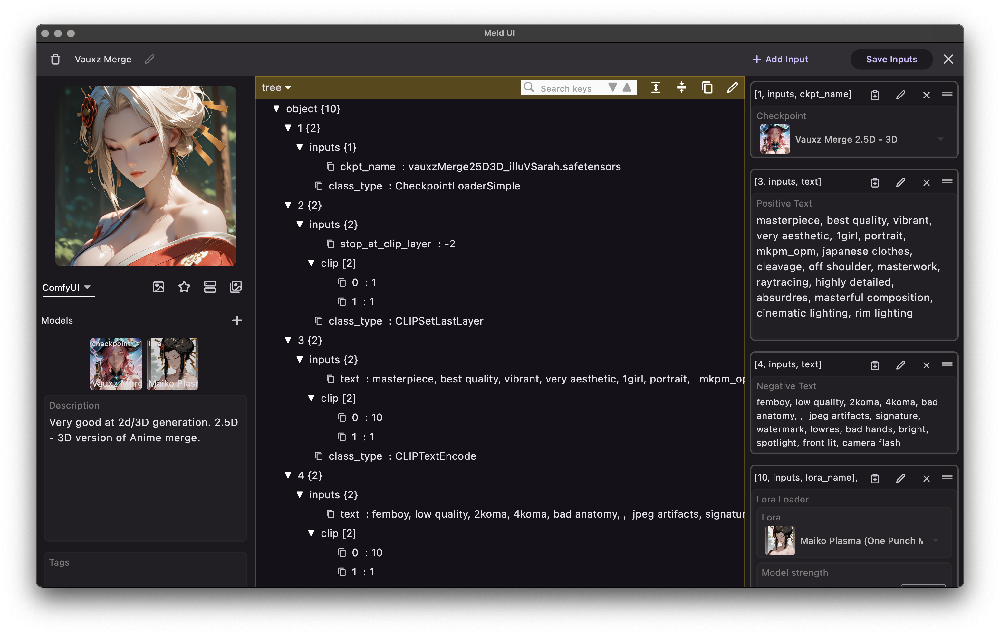
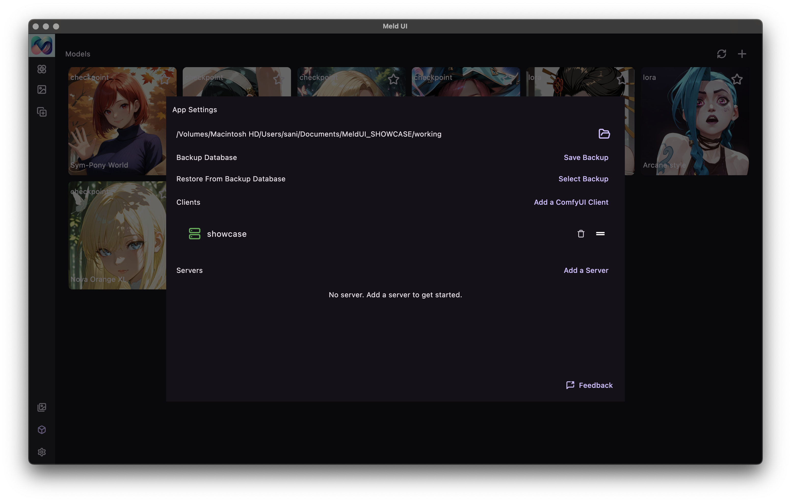

# MeldUI

# 🌟 **Your Creative Hub: Manage and Generate Images with Ease!**

We’ve built an app that transforms the way you manage and generate images. Perfect for digital artists, designers, and anyone exploring creative possibilities, this app brings together **smart image management** and the magic of **ComfyUI** workflows—all wrapped in a sleek, intuitive interface.

> simplify creativity and enhance productivity

---

  
MeldUI Showcase

  
  
  
  
  

## 🔧 **Key Features**

### ✨ **1. Seamless ComfyUI Integration**
Setting up your ComfyUI workflows has never been easier. With just a few clicks, you can:
- Load your workflows effortlessly.
- Customize them within the app.
- Run them easily with press of a button.
- Start generating images in no time!

> **Tip:** You can add as many **ComfyUI** endpoint as you want either in remote server or local network. The app will manage them effortlessly.

---

### 🔄 **2. Ridiculously Intuitive Design**
Forget complicated menus or confusing tools. This app is built to be:
- **Beginner-friendly:** Get started in seconds.
- **Pro-ready:** Advanced features are always within reach.
- **Smartly organized:** Everything is where you expect it to be.

---

### 🔺 **3. Your Workspace, Your Rules**
Tailor the UI to match your unique workflow. With a fully customizable interface, you can:
- Rearrange tools and menus.
- Pick themes to match your style.
- Create a creative space that’s uniquely yours.

---

### 📁 **4. Stress-Free Image Management**
Managing your image library shouldn’t feel like a chore. Our app makes it easy to:
- Tag and categorize your images.
- Search and find files instantly.
- Preview your work at a glance.

---

### 🛠️ **6. One-Click Image Server**
The app comes with a separate **image server** that can be hosted anywhere—on your local machine, a cloud server, or even your office network. Here’s what makes it special:
- **No Setup Required:** It’s literally one-click to start.
- **High Performance:** Optimized for speed and reliability, the server ensures smooth image handling no matter where it’s hosted.
- **Flexible Deployment:** You decide where to host it for maximum convenience.

> **Bonus:** The server integrates seamlessly with the app, giving you the freedom to focus on creativity instead of configuration.

---

## 🛠️ **Still in Progress: How You Can Help!**

While the app is already powerful, there’s still **so much more to come!** We’re constantly working to:
- Add exciting new features.
- Refine performance and stability.
- Incorporate feedback from users like you.

Your support can help us take it to the next level. Share your ideas, test the app, or simply spread the word!

---

## 🎨 **Join the Journey!**

This app is currently available to **Patreon supporters**. By supporting us, you not only get access to the app and its features but also become a part of its growth and success.

> **Join us on Patreon** to unlock the app and be part of our creative journey.

If you’ve been searching for a smarter way to manage images and unlock the full potential of ComfyUI, look no further. Let’s make creativity simple, intuitive, and fun together.

